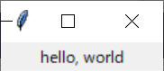

# hylibtk

Before starting development in Windows, set an environment variable:  
`PYTHONDONTWRITEBYTECODE` `""`  
(In Linux, this might not work fine. That's why I don't support Linux).  
For more information, see https://github.com/hylang/hy/issues/1324.

***

hylibtk is a library of Hy for Tkinter.

example/window.hy:
```
(require [hylibtk [*]])
(import [hylibtk [*]])

(tk root {})

(.mainloop root)
```


example/label.hy:
```
(require [hylibtk [*]])
(import [hylibtk [*]])

(tk root {}
  (label hello {:text "hello, world"}))

(.mainloop root)
```

